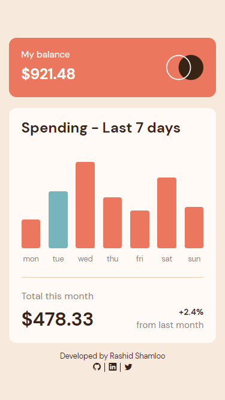
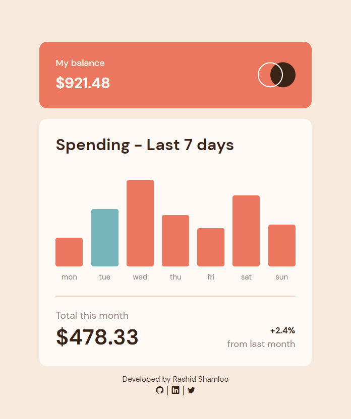

# Front End Mentor - Project 023 - Expenses Chart Component

This is a solution to the [ Expenses Chart Component challenge on Frontend Mentor](https://www.frontendmentor.io/challenges/expenses-chart-component-e7yJBUdjwt).

## Table of contents

- [Overview](#overview)
  - [Screenshot](#screenshot)
  - [Links](#links)
- [My process](#my-process)
  - [Built with](#built-with)
  - [What I learned](#what-i-learned)
  - [Useful resources](#useful-resources)
- [Author](#author)

## Overview

### Screenshot

- Mobile

- Desktop

### Links

- Solution URL: https://github.com/rashidshamloo/fem_023_expenses-chart-component/
- Live Site URL: https://rashidshamloo.github.io/fem_023_expenses-chart-component/

## My process

### Built with

- React
- Semantic HTML5 markup
- Sass
- CSS Flexbox

### What I learned

- Using Vite to create a React application
- Using React and Implementing components
- Using "defaultProps" to set default values for component properties
- Using the "useState()" hook in React
- Using Sass/Scss with Vite/React
- Passing data between components
- Handling events inside components
- Using "Date()" and "toLocaleString()" to get the day of the week
- Using "gh-pages" to deploy React applications to GitHub Pages

### Useful resources

- [Modern Normalize](https://github.com/sindresorhus/modern-normalize) - The CSS reset/normalize i used in this project

## Author

- Frontend Mentor - [@rashidshamloo](https://www.frontendmentor.io/profile/rashidshamloo)
- Twitter - [@rashidshamloo](https://www.twitter.com/rashidshamloo)
